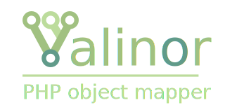

<div align="center">



<div>— From boring old arrays to shiny typed objects —</div>

<br>

[][link-packagist]
[][link-packagist]
[][link-packagist]
[](https://dashboard.stryker-mutator.io/reports/github.com/CuyZ/Valinor/master)

</div>

---

Valinor takes care of the construction and validation of raw inputs (JSON, plain
arrays, etc.) into objects, ensuring a perfectly valid state. It allows the
objects to be used without having to worry about their integrity during the
whole application lifecycle.

The validation system will detect any incorrect value and help the developers by
providing precise and human-readable error messages.

The mapper can handle native PHP types as well as other advanced types supported
by [PHPStan] and [Psalm] like shaped arrays, generics, integer ranges and more.

The library also provides a normalization mechanism that can help transform any
input into a data format (JSON, CSV, …), while preserving the original 
structure.

## Installation

```bash
composer require cuyz/valinor
```

**📔 Read more on the [online documentation](https://valinor.cuyz.io)**

## Example

```php
final class Country
{
    public function __construct(
        /** @var non-empty-string */
        public readonly string $name,
        
        /** @var list<City> */
        public readonly array $cities,
    ) {}
}

final class City
{
    public function __construct(
        /** @var non-empty-string */
        public readonly string $name,
        
        public readonly DateTimeZone $timeZone,
    ) {}
}

$json = <<<JSON
    {
        "name": "France",
        "cities": [
            {"name": "Paris", "timeZone": "Europe/Paris"},
            {"name": "Lyon", "timeZone": "Europe/Paris"}
        ]
    }
JSON;

try {
    $country = (new \CuyZ\Valinor\MapperBuilder())
        ->mapper()
        ->map(Country::class, \CuyZ\Valinor\Mapper\Source\Source::json($json));

    echo $country->name; // France 
    echo $country->cities[0]->name; // Paris
} catch (\CuyZ\Valinor\Mapper\MappingError $error) {
    // Handle the error…
}
```

## Documentation

The full documentation is available on [valinor.cuyz.io].

## Credits & thank you

The development of this library is mainly motivated by the kind words and the
help of many people. I am grateful to everyone, especially to the contributors
of this repository who directly help to push the project forward:

[](https://github.com/cuyz/valinor/graphs/contributors)

### Powered by

[](https://jb.gg/OpenSourceSupport)

I have to give [JetBrains] credits for providing [a free PhpStorm license] for
the development of this open-source package.

### Special thanks

I also want to thank
[![blackfire-logo] Blackfire](https://www.blackfire.io/?utm_source=valinor&utm_medium=readme&utm_campaign=free-open-source)
for providing a license of their awesome tool, leading to notable performance
gains when using this library.

[link-packagist]: https://packagist.org/packages/cuyz/valinor

[contributors]: https://github.com/CuyZ/Valinor/graphs/contributors

[PHPStan]: https://phpstan.org/

[Psalm]: https://psalm.dev/

[Jetbrains]: https://www.jetbrains.com/

[a free PhpStorm license]: https://jb.gg/OpenSourceSupport

[Blackfire]: https://www.blackfire.io/?utm_source=valinor&utm_medium=readme&utm_campaign=free-open-source

[blackfire-logo]: docs/pages/img/blackfire-logo.svg "Blackfire logo"

[valinor.cuyz.io]: https://valinor.cuyz.io
