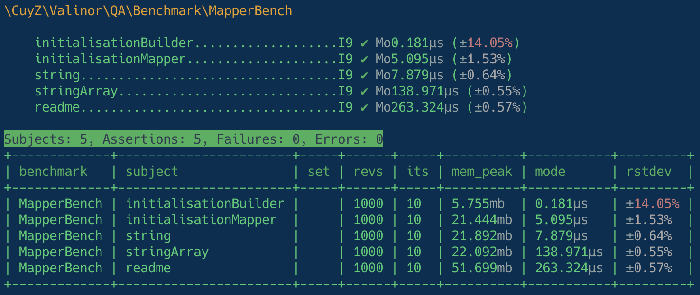
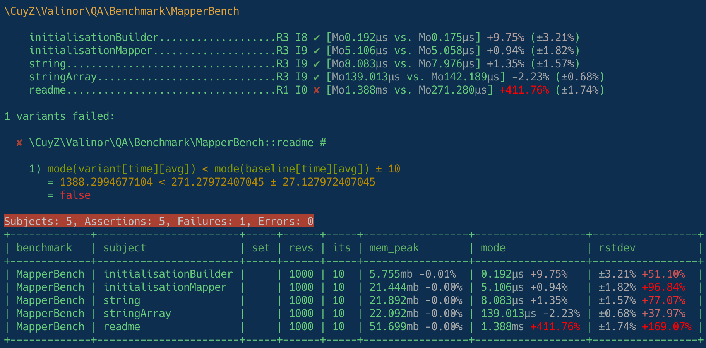

# Benchmarks

This package provides a few benchmarks to know how well it performs. This is
helpful to know if new features or refactorings degrade the performance.

## Running them

After installing the project on your machine, you can run:

```sh
composer run-script benchmark
```

This will run all the benchmarks and will produce an output like this:



The interesting information is located in the table at the bottom.

=== "`benchmark`"
    This is the class name containing the benchmark being run. Here
    `MapperBench` corresponds to the `\CuyZ\Valinor\QA\Benchmark\MapperBench`
    class located at `qa/Benchmark/MapperBench.php`.

=== "`subject`"
    This is the method name inside the benchmark class. Here `readme`
    corresponds to `\CuyZ\Valinor\QA\Benchmark\MapperBench::readme()`

=== "`revs`"
    This is the number of _revolutions_. It's the number of times the _subject_
    is called consecutively.

    By default the project runs them a 1000 times to have a good average. Each
    subject executes in micro, or milli, seconds, meaning that it's easy to have
    a large variation between each run. The higher the number of revolutions the
    more stable is the benchmark.

    ??? note "Warmup"
        Before benching a subject it runs it once but that revolution is now
        included in the statistics.

        This first run is here due to the impact of Composer class autoloading.
        This run will be the first to encounter a class and `require` it, this
        means doing IO. But once it's loaded the subsequent revolutions won't do
        the IO part.

        This means that the time seen in the _mode_ doesn't include the
        autoloading time. So it doesn't completely reflect the real execution
        time that can be observed in an end user project. But since this project
        can't affect the time it takes Composer to load classes it's ok to not
        include it in these benchmarks.

=== "`its`"
    This is the number of _iterations_. It's the number of processes running a
    _subject_.

    By default the project runs them 10 times. This means each iteration runs a
    1000 times the _subject_, for a total of 10000 calls.

    Just like _revolutions_, having multiple iterations allows to have a better
    _mode_.

=== "`mem_peak`"
    The maximum memory it took to bench the subject, across all _revolutions_
    and _iterations_.

=== "`mode`"
    This is the average time it took to run the _subject_.

    In essence it's the sum of the 10000 calls execution time divided by 10000.

=== "`rstdev`"
    This is the time deviation between _iterations_. A high percentage means
    each _iteration_ execution time is very different from the other ones. This
    may indicate the code is non-deterministic, meaning each _revolution_ runs a
    different code or is affected by IO operations.

    As indicated in the [documentation] this value should be below 2%.

    [documentation]: https://phpbench.readthedocs.io/en/latest/quick-start.html#increase-stability

## Comparing against a baseline

As said above, the goal of benchmarks is to know if some new code introduces a
regression in performance.

You first need to create a baseline. This is running the benchmarks and storing
the results. It's done via this command:

```sh
composer run-script benchmark-baseline
```

Then you can do the code modification you want in the project. And to know if
you introduce a regression you run:

```sh
composer run-script benchmark-compare
```

In case of a regression, it will produce an output like this:



In the columns `mem_peak`, `mode` and `rstdev` you'll find a new percentage
indicating the difference between your code and the baseline.

If any subject's average execution time goes above the baseline one, within a
margin of error of 10%, it will fail the command.

!!! success ""
    To simplify your life, this benchmark comparison is automatically run for
    you when opening a Pull Request on this project.

    And the CI will fail in case there's a regression.

??? note
    Since the `rstdev` value is meant to be as low as possible in the baseline
    any slight variation will make the comparison diff percentage go high. So
    any red value in this column doesn't necessarily mean there's something
    wrong.

    This is also why there's no assertion on this value.
